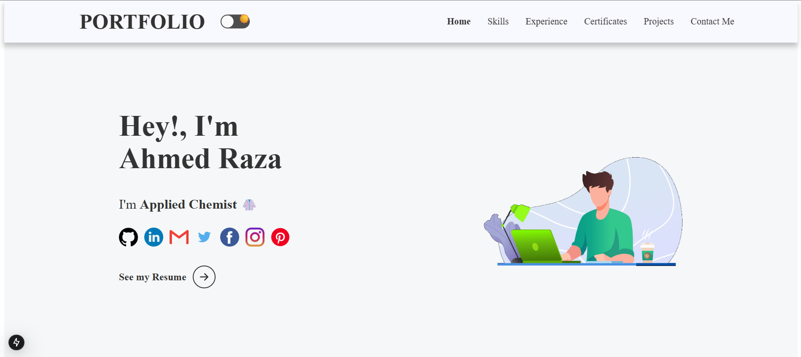

# 🚀 Ahmed Raza | Personal Portfolio



[](https://ahmedrazaportfolio.netlify.app/)
...

## 📝 Description

A professional personal portfolio website showcasing my journey as an Applied Chemist and Web Developer. Recently migrated from a standard React (CRA) architecture to **Next.js 15+** to significantly improve SEO performance, loading speeds, and server-side rendering capabilities.

## 🛠️ Tech Stack

* **Framework:** [Next.js](https://nextjs.org/)
* **Styling:** [Styled-Components](https://styled-components.com/)
* **Animations:** [Framer Motion](https://www.framer.com/motion/)
* **Package Manager:** [Yarn](https://yarnpkg.com/)
* **Deployment:** [Netlify](https://www.netlify.com/)

## 🚀 Key Features

* **Optimized Performance:** Leveraged Next.js to ensure lightning-fast page loads and better search engine indexing.
* **Dynamic Content:** Used structured data objects to manage projects and experience, making it easy to add new entries.
* **Interactive UI:** Responsive design with fluid animations powered by Framer Motion.
* **Dark/Light Mode:** Seamless theme switching integrated across all components.

## 📦 Getting Started

### Prerequisites

Make sure you have [Node.js](https://nodejs.org/) and [Yarn](https://yarnpkg.com/) installed on your machine.

### Installation

1. Clone the repository:
```bash
git clone https://github.com/ahmedraza17260/raza-portfolio.git

```


2. Navigate to the project directory:
```bash
cd raza-portfolio

```


3. Install dependencies using Yarn:
```bash
yarn install

```


4. Start the development server:
```bash
yarn dev

```


## 🌐 Live Preview

Visit the live site: [https://ahmedrazaportfolio.netlify.app/](https://ahmedrazaportfolio.netlify.app/)

## 👨‍💻 Author

**Ahmed Raza**

* [GitHub](https://github.com/ahmedraza17260)
* [LinkedIn](https://www.linkedin.com/in/ahmedraza17260/)
